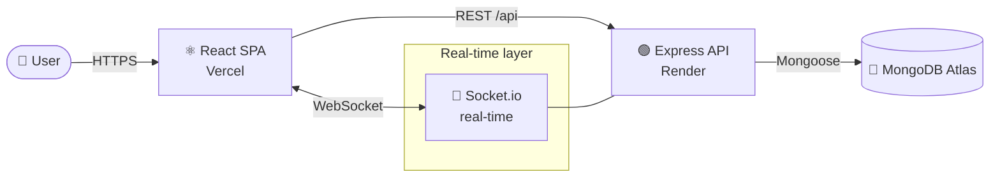

<div align="center">


# DevSync

### **Every team. One pulse. Zero chaos.**

A real-time collaboration platform that collapses your organizations, teams, projects, tasks and conversations into a single living workspace — the work, the people, and the pulse in one place.

<br/>

[](https://dev-sync-eta.vercel.app)
[](https://devsync-b3mx.onrender.com)

<br/>


</div>

---

## 🎯 Overview

**DevSync** is a full-stack team workspace inspired by the best of Jira, Trello and Slack — rebuilt as one cohesive system. Organizations invite members, spin up teams, plan projects, break them into tasks, move them across a Kanban board, and talk it all through in real time — while every action is captured in a live activity feed.

Built on the **MERN stack** with **Socket.io** powering the real-time layer: chat, notifications and board updates propagate instantly across every connected client.

<div align="center">

</div>

---

## ✨ Features

| | Feature | Description |
|---|---|---|
| 🏢 | **Organizations** | Create organizations, invite members by email, manage access |
| 👥 | **Teams & Roles** | Build teams inside an org, add/remove members, change roles |
| 📁 | **Projects** | Group work into projects linked to teams |
| ✅ | **Tasks** | Assign tasks with priority, status, deadlines and assignees |
| 📋 | **Kanban Board** | Drag tasks across `To-Do → In Progress → Review → Done` |
| 💬 | **Team Chat** | Real-time messaging with edit, delete and file sharing |
| 🔔 | **Notifications** | Instant, socket-powered notifications on key events |
| 📊 | **Dashboard** | Live overview of teams, projects and task progress |
| 📜 | **Activity Log** | Every create/update/delete captured as an audit trail |
| 🔍 | **Search & Filter** | Search across teams, projects and tasks |
| ✉️ | **Invitations** | Token-based invite / accept / reject / cancel flow |
| 🔐 | **Secure Auth** | JWT access + refresh tokens in httpOnly cookies |

---

## 🛠️ Tech Stack

**Frontend**
- ⚛️ React 19 + Vite
- 🧭 React Router 7
- 🎞️ Framer Motion (animations)
- 🎨 Lucide Icons
- 🔌 Socket.io Client
- 📡 Axios

**Backend**
- 🟢 Node.js + Express 5
- 🍃 MongoDB + Mongoose
- 🔌 Socket.io (real-time)
- 🔑 JWT + bcrypt
- 🍪 Cookie-based sessions
- 📎 Multer (file uploads)

**Infrastructure**
- ▲ Vercel (frontend)
- 🎯 Render (backend)
- 🍃 MongoDB Atlas (database)

---

## 🏗️ Architecture



**How it fits together**
- The **React SPA** talks to the API over REST for all CRUD, and holds an open **WebSocket** for live chat, notifications and board updates.
- The **Express API** is organized into 12 self-contained modules (`controller / model / routes / middleware` each), authenticates every request with JWT, and logs every mutation.
- **Socket.io** shares the same JWT auth and pushes events to the right rooms so clients stay in sync without polling.

---

## 📡 API Modules

The backend exposes 12 REST modules under `/api`:

| Module | Base Route | Purpose |
|--------|-----------|---------|
| Auth | `/api/auth` | Signup, login, refresh, logout |
| Organization | `/api/organization` | Orgs & members |
| Team | `/api/team` | Teams, members, roles |
| Project | `/api/project` | Project CRUD |
| Task | `/api/task` | Task CRUD, status, assignee |
| Kanban | `/api/kanban` | Board status updates |
| Activity | `/api/activity` | Audit / change history |
| Dashboard | `/api/dashboard` | Aggregated metrics |
| Search | `/api/search` | Search & filter |
| Notify | `/api/notify` | Notifications |
| Chat | `/api/chat` | Team messaging + files |
| Invitation | `/api/invitation` | Invite flow |

---

## 🚀 Getting Started

### Prerequisites
- Node.js 18+
- A MongoDB Atlas connection string (or local MongoDB)

### 1. Clone the repo
```bash
git clone https://github.com/RealAbhinav001/DevSync.git
cd DevSync
```

### 2. Backend setup
```bash
cd Backend
npm install
cp .env.example .env   # then fill in your values
npm run dev
```

### 3. Frontend setup
```bash
cd Frontend
npm install
cp .env.example .env   # then fill in your values
npm run dev
```

Frontend runs on `http://localhost:5173`, backend on `http://localhost:5000`.

---

## 🔧 Environment Variables

**Backend** (`Backend/.env`)
```env
PORT=5000
NODE_ENV=development
MONGO_URI=your_mongodb_atlas_uri
SECRET_KEY=your_jwt_secret
CLIENT_URL=http://localhost:5173
```

**Frontend** (`Frontend/.env`)
```env
VITE_API_URL=http://localhost:5000/api
```

---

## 📂 Project Structure

```
DevSync/
├── Backend/
│   └── src/
│       ├── config/          # db + env config
│       ├── middleware/       # uploads, etc.
│       ├── modules/          # 12 feature modules (auth, team, task, chat…)
│       │   └── realTime/     # Socket.io setup & handlers
│       ├── services/         # notification service
│       ├── utils/            # activity logger
│       ├── app.js            # express app + routes
│       └── server.js         # http + socket server
└── Frontend/
    └── src/
        ├── api/              # axios instances per module
        ├── components/       # layout & shared UI
        ├── context/          # auth context
        ├── pages/            # route pages
        └── routes/           # app + protected routes
```

---

## 🗺️ Roadmap

DevSync is actively being hardened toward production grade:

- [x] Full MERN feature set (orgs, teams, projects, tasks, invites)
- [x] Real-time backend (chat, notifications, kanban via Socket.io)
- [x] JWT auth with httpOnly refresh cookies
- [x] Deployed (Vercel + Render + Atlas)
- [ ] Centralized error handling & input validation
- [ ] Automated tests (Jest + Supertest)
- [ ] Real-time UIs for chat, notifications & kanban
- [ ] API documentation (Swagger)

---

## 👤 Author

**Abhinav Chaubey**
[](https://github.com/RealAbhinav001)

---

<div align="center">

**⭐ If you like DevSync, give it a star!**

<sub>Built with the MERN stack and a lot of caffeine ☕</sub>

</div>
