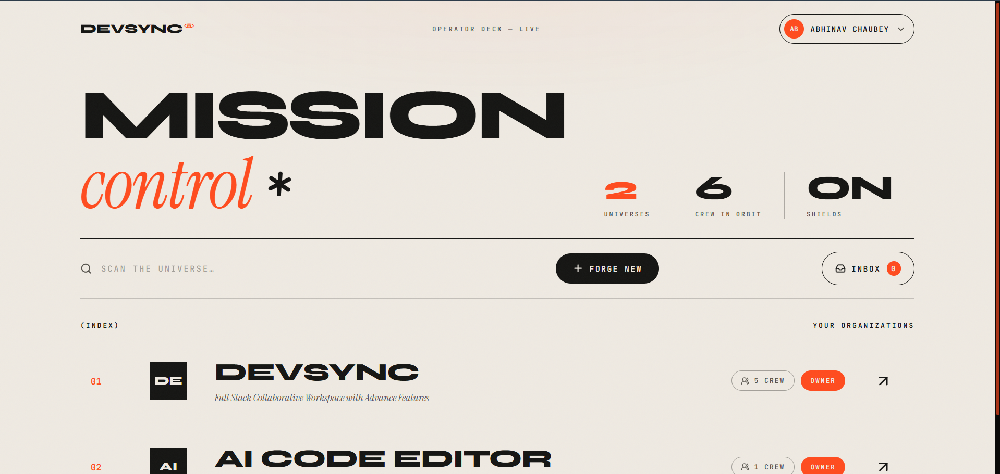
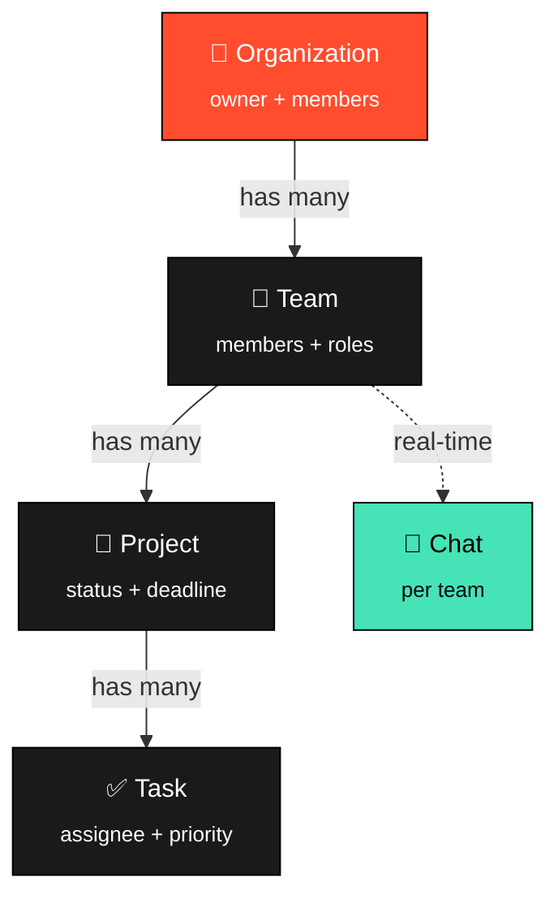
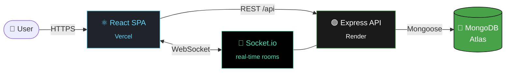
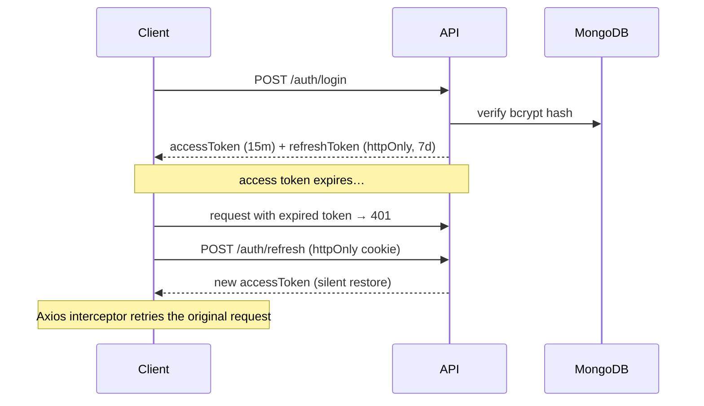
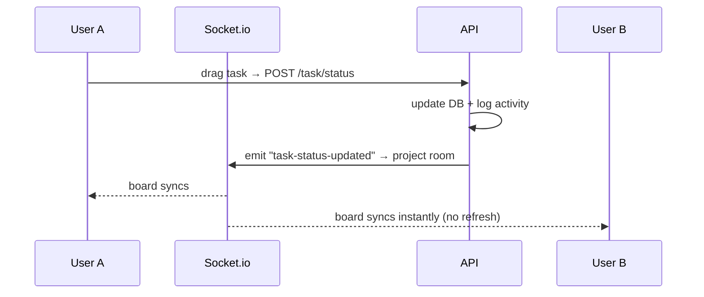

<div align="center">


# DevSync

### _Every team. One pulse. Zero chaos._

**A real-time, multi-tenant collaboration platform** that collapses organizations, teams, projects, tasks and conversations into a single living workspace — the work, the people, and the pulse in one place.

<br/>

[](https://dev-sync-eta.vercel.app)
[](https://devsync-b3mx.onrender.com)
[](#-testing)

<br/>


</div>

---

## 🎯 Overview

**DevSync** is a full-stack team workspace inspired by the best of **Jira, Trello and Slack** — rebuilt as one cohesive, real-time system. Organizations invite members, spin up teams, plan projects, break them into tasks, drag them across a Kanban board, and talk it all through in real time — while every action is captured in a live activity feed.

Built on the **MERN stack** with **Socket.io** powering the real-time layer: chat, notifications and board updates propagate **instantly** across every connected client — no refresh, no polling.

<div align="center">

</div>

---

## ⚡ Highlights

<table>
<tr>
<td width="50%" valign="top">

**🏗️ Multi-tenant by design**
A 4-level hierarchy — `Organization → Team → Project → Task` — with per-resource authorization derived at every level to eliminate IDOR.

**🔒 Production-grade security**
JWT access + refresh rotation, bcrypt, Zod validation on every route, Helmet, CORS, rate limiting, RBAC middleware.

</td>
<td width="50%" valign="top">

**🔌 Real-time everything**
Chat, notifications and Kanban sync over WebSocket rooms scoped per organization.

**✅ Tested & deployed**
58 automated authorization tests (Jest + Supertest) and a live multi-service cloud deployment.

</td>
</tr>
</table>

---

## ✨ Features

| | Feature | Description |
|---|---|---|
| 🏢 | **Organizations** | Create orgs, invite members by email, manage access |
| 👥 | **Teams & Roles** | Build teams inside an org, add/remove members, change roles (owner/member) |
| 📁 | **Projects** | Group work into projects linked to teams, with status & deadlines |
| ✅ | **Tasks** | Priority, status, deadlines and assignees |
| 📋 | **Kanban Board** | Drag tasks across `To-Do → In Progress → Review → Done` — synced live |
| 💬 | **Team Chat** | Real-time messaging with **edit, delete, typing indicator & file sharing** |
| 🔔 | **Notifications** | Instant, socket-powered notifications on key events |
| 📊 | **Dashboard** | Live overview of teams, projects and task progress |
| 📜 | **Activity Log** | Every create/update/delete captured as an audit trail, filterable by type |
| 🔍 | **Search & Filter** | Debounced search across teams & projects + status filtering |
| ✉️ | **Invitations** | Token-based invite / accept / reject / cancel flow |
| 🔐 | **Secure Auth** | JWT access + refresh tokens in httpOnly cookies, silent session restore |

---

## 🧬 Data Model — the hierarchy

Everything hangs off a single multi-tenant tree. Authorization is checked at **every** level.


```mermaid
flowchart TD
    O["🏢 Organization<br/><sub>owner + members</sub>"]
    T["👥 Team<br/><sub>members + roles</sub>"]
    P["📁 Project<br/><sub>status + deadline</sub>"]
    K["✅ Task<br/><sub>assignee + priority</sub>"]
    C["💬 Chat<br/><sub>per team</sub>"]

    O -->|has many| T
    T -->|has many| P
    P -->|has many| K
    T -.->|real-time| C

    style O fill:#FF4D2E,stroke:#000,color:#fff
    style T fill:#1a1a1a,stroke:#000,color:#fff
    style P fill:#1a1a1a,stroke:#000,color:#fff
    style K fill:#1a1a1a,stroke:#000,color:#fff
    style C fill:#46E3B7,stroke:#000,color:#000
```

---

## 🏗️ Architecture


```mermaid
flowchart LR
    U([👤 User]) -->|HTTPS| FE["⚛️ React SPA<br/><sub>Vercel</sub>"]
    FE -->|REST /api| BE["🟢 Express API<br/><sub>Render</sub>"]
    FE <-->|WebSocket| WS["🔌 Socket.io<br/><sub>real-time rooms</sub>"]
    WS --- BE
    BE -->|Mongoose| DB[("🍃 MongoDB<br/>Atlas")]

    style FE fill:#20232A,stroke:#61DAFB,color:#61DAFB
    style BE fill:#1a1a1a,stroke:#339933,color:#fff
    style WS fill:#010101,stroke:#46E3B7,color:#46E3B7
    style DB fill:#47A248,stroke:#000,color:#fff
```

**How it fits together**
- The **React SPA** talks to the API over REST for all CRUD, and holds an open **WebSocket** for live chat, notifications and board updates.
- The **Express API** is organized into 12 self-contained modules (`controller / model / routes / middleware` each), authenticates every request with JWT, validates with Zod, and logs every mutation.
- **Socket.io** shares the same JWT auth and pushes events to per-organization rooms so clients stay in sync without polling.

---

## 🔐 Auth flow — access + refresh rotation


```mermaid
sequenceDiagram
    participant C as Client
    participant A as API
    participant DB as MongoDB

    C->>A: POST /auth/login
    A->>DB: verify bcrypt hash
    A-->>C: accessToken (15m) + refreshToken (httpOnly, 7d)

    Note over C,A: access token expires…
    C->>A: request with expired token → 401
    C->>A: POST /auth/refresh (httpOnly cookie)
    A-->>C: new accessToken (silent restore)
    Note over C: Axios interceptor retries the original request
```

---

## ⚡ Real-time flow — a Kanban move


```mermaid
sequenceDiagram
    participant U1 as User A
    participant WS as Socket.io
    participant API as API
    participant U2 as User B

    U1->>API: drag task → POST /task/status
    API->>API: update DB + log activity
    API->>WS: emit "task-status-updated" → project room
    WS-->>U1: board syncs
    WS-->>U2: board syncs instantly (no refresh)
```

---

## 🛠️ Tech Stack

<table>
<tr>
<td valign="top" width="33%">

**Frontend**
- ⚛️ React 19 + Vite
- 🧭 React Router 7
- 🎞️ Framer Motion
- 🎨 Lucide Icons
- 🧩 @dnd-kit (Kanban)
- 🔌 Socket.io Client
- 📡 Axios

</td>
<td valign="top" width="33%">

**Backend**
- 🟢 Node.js + Express 5
- 🍃 MongoDB + Mongoose
- 🔌 Socket.io
- 🔑 JWT + bcrypt
- 🛡️ Zod + Helmet
- 🚦 express-rate-limit
- 📎 Multer

</td>
<td valign="top" width="33%">

**Infra & Tooling**
- ▲ Vercel (frontend)
- 🎯 Render (backend)
- 🍃 MongoDB Atlas
- 🧪 Jest + Supertest
- 📊 Winston + Morgan
- ✨ ESLint + Prettier

</td>
</tr>
</table>

---

## 🧪 Testing

Authorization is the heart of a multi-tenant app — so it's covered by an automated suite.

```bash
cd Backend
npm test
```

- **58 passing tests** across auth, organization, team, project & task modules
- Every RBAC guard proven: **owner / member / outsider / no-token** on each protected route
- Runs against an in-memory MongoDB (`mongodb-memory-server`) — isolated, fast, zero external deps
- Negative-first: duplicate email → 409, wrong password → 401, non-owner → 403, invalid input → 400

> The test suite surfaced (and fixed) 3 real bugs — including validation/model mismatches that returned 500s in production.

---

## 📡 API Modules

The backend exposes 12 REST modules under `/api`, each a self-contained `controller · model · routes · middleware`:

| Module | Base Route | Purpose |
|--------|-----------|---------|
| Auth | `/api/auth` | Signup, login, refresh, logout |
| Organization | `/api/organization` | Orgs & members |
| Team | `/api/team` | Teams, members, roles |
| Project | `/api/project` | Project CRUD |
| Task | `/api/task` | Task CRUD, status, assignee |
| Kanban | `/api/kanban` | Board status updates |
| Activity | `/api/activity` | Audit / change history |
| Dashboard | `/api/dashboard` | Aggregated metrics |
| Search | `/api/search` | Search & filter |
| Notify | `/api/notify` | Notifications |
| Chat | `/api/chat` | Team messaging + files |
| Invitation | `/api/invitation` | Invite flow |

---

## 🚀 Getting Started

### Prerequisites
- Node.js 18+
- A MongoDB Atlas connection string (or local MongoDB)

<details>
<summary><b>1 · Clone the repo</b></summary>

```bash
git clone https://github.com/RealAbhinav001/DevSync.git
cd DevSync
```
</details>

<details>
<summary><b>2 · Backend setup</b></summary>

```bash
cd Backend
npm install
cp .env.example .env   # then fill in your values
npm run dev
```
</details>

<details>
<summary><b>3 · Frontend setup</b></summary>

```bash
cd Frontend
npm install
cp .env.example .env   # then fill in your values
npm run dev
```
</details>

Frontend runs on `http://localhost:5173`, backend on `http://localhost:5000`.

---

## 🔧 Environment Variables

**Backend** (`Backend/.env`)
```env
PORT=5000
NODE_ENV=development
MONGO_URI=your_mongodb_atlas_uri
ACCESS_KEY=your_access_token_secret
REFRESH_KEY=your_refresh_token_secret
CLIENT_URL=http://localhost:5173
```

**Frontend** (`Frontend/.env`)
```env
VITE_API_URL=http://localhost:5000/api
VITE_SOCKET_URL=http://localhost:5000
```

---

## 📂 Project Structure

```
DevSync/
├── Backend/
│   ├── tests/                  # Jest + Supertest suites (58 tests)
│   └── src/
│       ├── config/             # db + env config
│       ├── middleware/         # validator, rate limiter, uploads
│       ├── validators/         # Zod schemas
│       ├── modules/            # 12 feature modules (auth, team, task, chat…)
│       │   └── realTime/       # Socket.io setup & handlers
│       ├── services/           # notification service
│       ├── utils/              # asyncHandler, ApiError, activity logger, logger
│       ├── app.js              # express app + routes
│       └── server.js           # http + socket server
└── Frontend/
    └── src/
        ├── api/                # axios instances per module
        ├── components/         # layout & shared UI
        ├── context/            # auth + socket + notification contexts
        ├── pages/              # route pages
        └── routes/             # app + protected + org layout routes
```

---

## 🗺️ Roadmap

- [x] Full MERN feature set (orgs, teams, projects, tasks, invites)
- [x] Real-time backend + **real-time UIs** (chat, notifications, Kanban via Socket.io)
- [x] JWT auth with httpOnly refresh cookies + silent restore
- [x] Centralized error handling & Zod input validation
- [x] Security hardening (Helmet, CORS, rate limiting, RBAC)
- [x] Automated tests (Jest + Supertest — 58 passing)
- [x] Activity log + search & filter UIs
- [x] Deployed (Vercel + Render + Atlas)
- [ ] API documentation (Swagger / OpenAPI)
- [ ] Pagination / infinite scroll on large lists
- [ ] Optimistic UI on Kanban & chat

---

## 👤 Author

**Abhinav Chaubey**

[](https://abhinav-portfolio-three-bice.vercel.app/)
[](https://www.linkedin.com/in/abhinav-chaubey-582b85338/)
[](https://github.com/RealAbhinav001)
[](https://leetcode.com/u/aUGjnkG8Gu/)

---

<div align="center">

**⭐ If DevSync resonates with you, drop a star!**

<sub>Built with the MERN stack, Socket.io, and a lot of caffeine ☕</sub>

</div>
